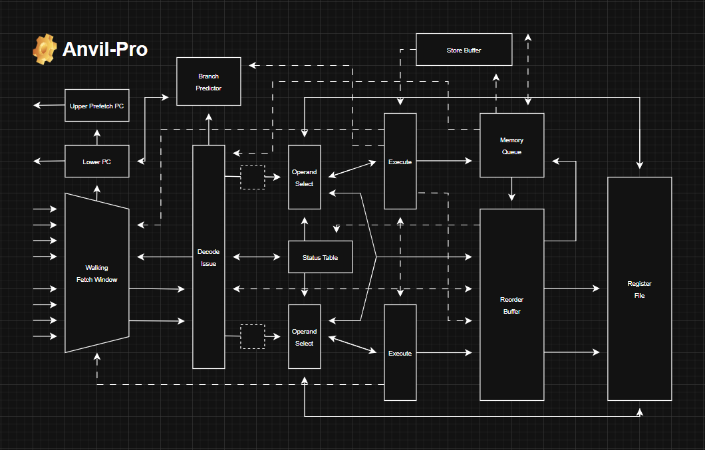
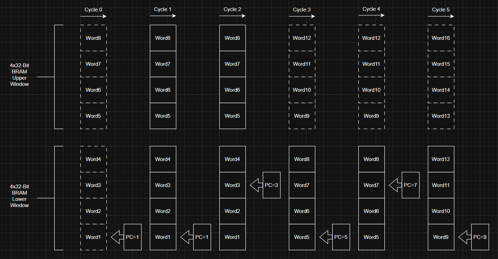

# Anvil-Pro: A Superscalar RISC-V Processor


## Overview
Anvil-Pro is a dual-issue RISC-V RV32I + Zicsr softcore targeting FPGA platforms. The core supports M-mode execution, a strict Harvard memory architecture, and a Wishbone Classic data interface for external memory integration.

The microarchitecture implements a 6-stage pipeline with in-order commit via a reorder buffer, a LSU with buffered memory queueing, and a 256-bit “Walking Window” fetch system. Instruction memory is implemented using inferred synchronous BRAM, while data memory is accessed through an external Wishbone interface.

The design is optimized for efficient FPGA fabric utilization, competitive performance, and scalable off-chip data memory capacity. The core is provided as synthesizable SystemVerilog and is suitable for FPGA compute, architectural experimentation, simulation, and custom RISC-V system integration.

## Architectural Roadmap
- Dual-Issue Superscalar Front-End
- In-Order Commit ROB
- Precise Trap / Exception Support
- M-Mode RV32I + Zicsr
- Harvard Split BRAM IMEM + External DMEM
- 256-Bit "Walking Window" Prefetch
- Single LSU (Wishbone Classic)
- Store / Load Buffering + Queue
- 6-Stage Pipeline

## Repository Graph
```bash
Core/                              # Main RTL Folder
├─ Blocks/                         # Reusable IP Blocks
│  └─ Decoder.sv                   # Decodes Instructions Into Enable Signals
├─ Control/                        # Pipeline Support Infrastructure Folder
│  ├─ Control.sv                   # Flushes Pipeline
│  ├─ RegisterFile.sv              # Holds Objective Register Data
│  ├─ RegisterStatusTable.sv       # Dictates Register Ownership and State
│  └─ StoreBuffer.sv               # Bypasses Load Issue Restrictions
├─ Memory/                         # Memory Interface Folder
│  ├─ InstructionMemory.sv         # BRAM Instruction Memory
│  ├─ Instructions.hex             # Hex Instruction Initializer
│  └─ PlaceholderDMEM.sv           # Placeholder Data Memory For Simulation
├─ Package/                        # SystemVerilog Package Folder
│  ├─ Configuration.sv             # Configurable Parameters
│  ├─ Enumerations.sv              # Vector Enumeration Definitions
│  └─ Payloads.sv                  # Structure Definitions
├─ Pipeline/                       # Pipeline Folder
│  ├─ DecodeIssue.sv               # Decoder And Issue Contract Enforcer
│  ├─ Execute.sv                   # ALU And Memory Packet Contructor
│  ├─ MemoryQueue.sv               # Drives Wishbone And Queues Memory Ops
│  ├─ OperandSelect.sv             # Multiplexes And Selects Data Sources 
│  ├─ ReorderBuffer.sv             # Accepts And Retires Results From Pipeline
│  └─ WalkingWindow.sv             # Feeds Decoders And Holds PC
└─ Top.sv                          # Hirearchical Top Level Module
```

## Frontend
### Fetch Methodology
Anvil-Pro’s front end is designed to sustain a 2-wide issue demand while minimizing redirect penalty and keeping FPGA fabric cost low. Sharing an external instruction interface with the DMEM subsystem was evaluated and rejected: bus arbitration and protocol state add latency, introduce additional control complexity, and reduce deterministic control of fetch timing. Instead, Anvil-Pro uses a strict Harvard organization. IMEM is implemented as inferred synchronous BRAM, allowing instruction fetch to run independently of LSU traffic.

With BRAM-backed IMEM, the remaining optimization is microarchitectural. Canonical queue-driven fetch buffering was initially deployed, but the additional state (FIFO depth, fill/drain behavior, tagging, and boundary handling) increased area and amplified redirect recovery cost. The final design uses a custom 256-bit “Walking Window” prefetch mechanism that exploits wide BRAM reads and dual read ports. Two adjacent 128-bit aligned windows track the canonical PC and are incremented alongside it. Decode requests are satisfied by slicing 32-bit instructions directly from these windows, allowing the BRAM -> IF/ID path to remain direct with no additional stateful staging.



Redirects are wired directly into the registered BRAM address path, so a control transfer immediately updates the fetch address without draining or refilling an intermediate queue. Because no FIFO sits between BRAM and IF/ID, redirect recovery does not pay a queue drain/refill penalty; the next-path instruction becomes visible as soon as the redirected BRAM read returns. This keeps the front end small, deterministic, and tightly aligned with FPGA memory behavior while still providing enough lookahead to sustain a 2-issue demand under sequential flow.

Taken together, the design sustains ~2 IPC to the backend on branchless workloads. Following a misprediction, fetch incurs no cycle penalty and the correct instruction stream is already available as if in linear program-order. The approach also avoids LUTRAM-heavy structures such as caches or prefetch queues, substantially reducing FPGA resource usage.

### Issuer Architecture
In many dual-issue designs, the backend is responsible for dynamically resolving hazards through stall propagation, cross-lane forwarding, replay behavior, and inter-stage backpressure. While flexible, that approach introduces long combinational paths, additional control state, and significant verification complexity. These mechanisms directly impact Fmax and make timing closure more difficult.

Anvil-Pro adopts a different philosophy: hazards are prevented at dispatch rather than repaired during execution. The issuer enforces a strict structural contract that guarantees the backend never encounters a stall condition. Once an instruction is dispatched into the pipeline, it flows forward unconditionally. There are no backend freeze signals, no inter-stage ready/valid backpressure, and no replay logic. All throttling occurs exclusively at issue time through refusal.

Traditional stall-based pipelines require bubble injection when a hazard is encountered. If one instruction cannot advance, pipeline registers must be frozen and bubbles inserted to preserve correctness. In a paired in-order machine, this typically forces both lanes to stall to maintain age alignment, even if one instruction could logically continue. This demands inter-lane stall propagation, stage enable gating, and careful management of partially executed instructions.

Anvil-Pro eliminates this entire category of behavior. ALU operations complete in fixed latency. Memory operations are injected into the Memory Queue and complete asynchronously. ROB entries are allocated strictly at issue. Future multi-cycle executions can be buffered similar to the memory queue. Once dispatched, instructions are never held mid-pipeline and no bubbles are injected due to backend hazards.

If the next instruction cannot safely dispatch due to operand availability or structural capacity, the issuer simply refuses it. The backend continues draining in-flight work but never freezes. Throughput modulation therefore occurs exclusively at issue time rather than through dynamic stall control or bubble propagation.

Under strict in-order issue, issue refusal and traditional stall models exhibit similar IPC behavior during true dependency waits. The primary advantage of Anvil-Pro’s methodology is structural: reduced control depth, simplified verification, and improved timing characteristics. The tradeoff is modest additional resume latency when a previously blocked instruction becomes eligible to issue, since it must traverse the full backend pipeline rather than resuming mid-stage. It was concluded that the simplicity and timing benefits generally outweigh the marginal latency impact for this implementation.

### Issuer Contract
The issuer guarantees that any dispatched instruction group satisfies the following invariants:
```bash
# Issuer Contract
- Slot 1 may not issue a memory operation
- Slot 1 may not issue if it writes the same destination register as slot 0
- If EX/EX bypass is disabled, slot 1 may not issue if it depends on slot 0
- If EX/EX bypass is enabled, slot 1 slot-0 dependencies must use explicit bypass signals
- Slot 1 may not issue when badData is asserted
- Slot 1 may not issue if only 1 ROB slot is available
- Neither slot may issue if no ROB slots are available
- Neither slot may issue if slot 0 depends on an unresolved load
- Slot 1 may not issue if it depends on an unresolved load
- Neither slot may issue if slot 0 writes a destination register owned by an unresolved load
- Slot 1 may not issue if it writes a destination register owned by an unresolved load
- Slot 1 may not issue if slot 0 reads the destination register written by slot 1
- Neither slot may issue if slot 0 is illegal
- Slot 1 may not issue if slot 1 is illegal
- Memory operations may not issue unless the memory queue has sufficient free space
- CSR operations may not issue if another CSR operation is already in flight
```
## Backend
### Philosophy
Anvil-Pro contains a relatively simple backend compared to many other superscalar implementations. It features two pipelines, each composed of an operand-selection stage followed by an execute stage. After execution, instructions either return directly to the reorder buffer or are handed off to a unified memory queue, depending on the operation type.

The backend is built around a strict issue contract. Once an instruction is dispatched, it is expected to continue flowing forward without encountering a backend stall, and slot 0 is always older than slot 1. This allows the design to avoid replay behavior, bubble injection, and inter-stage freeze logic. Rather than repairing hazards dynamically after dispatch, Anvil-Pro prevents them at issue time.

These assumptions lead naturally to a useful distinction between two classes of backend work: non-blocking instructions and blocking instructions. Non-blocking instructions are fixed-latency operations that remain entirely within the core backend pipeline. They pass through operand select and execute, then present their results in-order to the reorder buffer after exactly three cycles. Because their timing is predictable, they form the basis of the backend’s permissive issue model and are intended to flow continuously.

Blocking instructions follow a different path. Rather than completing at a fixed latency inside the main execution fabric, they are handed off to a separate buffered execution structure. In Anvil-Pro, these are primarily memory operations. Once issued, they may remain in flight for an arbitrary amount of time while younger fixed-latency instructions continue to execute. When they eventually finish, they write their results back to the reorder buffer out of issue order.

This is where the reorder buffer becomes central to the backend organization. Although the machine remains architecturally in-order, the reorder buffer allows completion and retirement to be separated. Fixed-latency instructions and buffered operations may finish at different times, but the reorder buffer preserves correctness by holding results, providing forwarded data for completed but uncommitted instructions, and guaranteeing in-order commit. In this sense, the backend supports a constrained and purpose-built form of out-of-order completion without requiring a fully out-of-order scheduler.

Because of this structure, the issuer treats non-blocking and blocking instructions differently. Non-blocking instructions benefit from the backend’s fixed-latency assumptions and can be issued permissively. Blocking instructions require a more conservative issue policy, since unresolved memory operations can create dependencies that cannot be repaired later by backend stall logic. The design therefore attempts to hide the latency of blocking instructions through buffering, but when true dependencies arise, progress is regulated at issue time rather than by freezing the backend.

These same design premises simplify the forwarding network. Since slot 0 is always older than slot 1 and backend stalls are disallowed by construction, the operand-select stage only needs to consider a small, age-ordered set of candidate data sources. With EX/EX bypass disabled, each source operand can come from one of four places: the register file, the reorder buffer entry identified by the age tag, slot 1 execute, or slot 0 execute. The register status table determines which source is correct. This keeps the forwarding structure compact and avoids excessive fanout and FPGA routing complexity while still preserving correct data ordering.

Additionally, if EX/EX bypass is enabled, data can be forwarded directly from the output of slot 0’s ALU to one or both input operands of slot 1’s ALU. This allows specific same-cycle inter-slot dependencies to be handled explicitly, while still preserving the broader philosophy of issue-time hazard prevention and a stall-free backend.

### Redirect Handling
The pipeline handles redirects carefully to ensure precise architectural state is maintained and all speculative work is properly flushed. The dual execute stages generate a unified redirect signal gated by both legality and validity. When those conditions hold, the signal is asserted. All architectural side effects are then derived combinationally from that single assertion. The primary concerns are fourfold: flushing invalid reorder buffer entries, flushing invalid blocking-instruction queues, restoring correct register status table state, and invalidating the pipeline.

To flush the reorder buffer, the preexisting age-tag system is used to identify the exact desired state. Age tags in the pipeline serve as unique IDs as well as index variables for the reorder buffer. Despite the naming convention, they do not explicitly encode age. When a redirect is detected, the reorder buffer moves its tail pointer to the age tag of the taken branch plus one, which is already implicitly presented to the reorder buffer through the normal instruction retirement interface. Since the validity of the buffer is implicitly encoded by the range between the tail and head pointers, adjusting the tail pointer guarantees a precise flush. This mechanism is both simple and exact, avoiding the usual complexity associated with discarding speculative work.

To flush invalid blocking-instruction queues, the microarchitecture implicitly prevents blocking instructions from ever executing speculatively. Because the pipeline remains in order until post-execute, all branches are resolved before any younger blocking instruction can enter an asynchronous unit such as the memory queue.

Restoring correct RST state is subtle, yet absolutely critical to a proper redirect mechanism. Checkpoint-based systems were considered, but ultimately rejected due to unnecessary state and complexity. Instead, Anvil-Pro derives prior RST state directly from reorder buffer metadata. At most, only three additional instructions can be in the pipeline that may have corrupted RST state. As a result, only three buses or write indexes into the RST are required, which is surprisingly lightweight. On redirect, the pipeline examines the registers modified by speculative work, checks the reorder buffer to determine whether a previous owner exists, and derives the prior state from that metadata. That state is then broadcast to the RST, which restores itself on the following clock edge.

Pipeline invalidation is simple and arguably unnecessary, but it is still performed to eliminate ambiguity around valid and invalid work. On redirect, all younger instructions in the pipeline are invalidated. This prevents any edge-case architectural state change and ensures that no speculative work can take effect.

## Implimentation
### Notice
This core is in progress. Do not attempt to use it or understand the HDL unless you want to waste your time. Nobody but myself and god know the formal assumptions that allow it to function. This README is currently a technical reference notepad and architectural source of truth, and much is subject to change. Do not take it as a perfect reference, but rather a formalization of design ideas to hold myself accountable to.

### TODO List
- CSR File + Zicsr Decode
- System Instruction Support
- Precise Exceptions
- Interupt Support
- Memory Queue
- Illegal Flag + Handling
- RISCOF Pass

