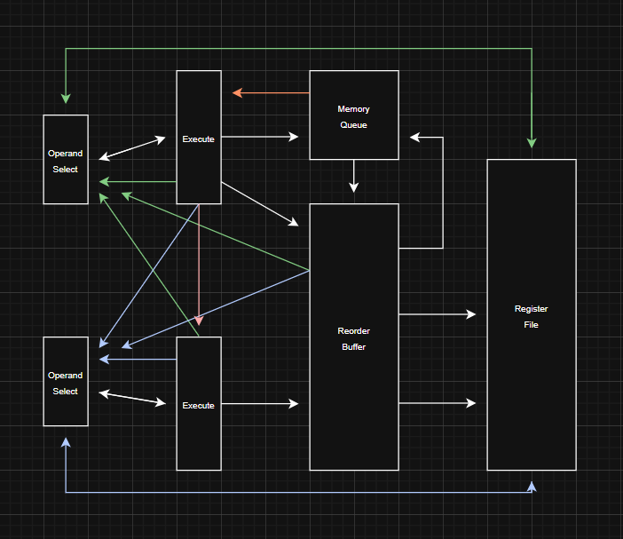

# Anvil-Pro: A Superscalar RISC-V Processor


## Overview
Anvil-Pro is a dual-issue RISC-V RV32I + Zicsr softcore targeting FPGA platforms. The core supports M-mode execution, a strict Harvard memory architecture, and a Wishbone Classic data interface for external memory integration.

The microarchitecture implements a 6-stage pipeline with in-order commit via a reorder buffer, a LSU with buffered memory queueing, and a 256-bit “Walking Window” fetch system. Instruction memory is implemented using inferred synchronous BRAM, while data memory is accessed through an external Wishbone interface.

The design is optimized for efficient FPGA fabric utilization, competitive performance, and scalable off-chip data memory capacity. The core is provided as synthesizable SystemVerilog and is suitable for FPGA compute, architectural experimentation, simulation, and custom RISC-V system integration.

## Architecture Highlights
- Dual-Issue Superscalar
- In-Order Commit ROB
- Precise Trap / Exception Support
- Latency Reordered Execution
- M-Mode RV32I + Zicsr
- Harvard Split BRAM IMEM + External DMEM
- Two-Bit Branch Prediction
- 256-Bit "Walking Window" Prefetch
- Issue Governed Hazard Resolution
- Single LSU (Wishbone Classic)
- Memory Queue + Store Buffer
- 6-Stage Pipeline
- Register Status Table Bookeeping

## Memory Map
Main Memory (RAM): `0x0000_0000` - `0x7FFF_FFFF`     
Device Memory (MMIO): `0x8000_0000` - `0xFFFF_FFFF`

mtimecmp: `0x8000_0000`     
mtimecmph: `0x8000_0004`     
mtime: `0x8000_0008`    
mtimeh: `0x8000_000C`     

## Repository Graph
```bash
Core/                              # Main RTL Folder
├─ Blocks/                         # Reusable IP Blocks
│  └─ Decoder.sv                   # Decodes Instructions Into Enable Signals
├─ Control/                        # Pipeline Support Infrastructure Folder
│  ├─ BranchPredictor.sv           # Configurable Non-BTB Branch Prediction
│  ├─ Control.sv                   # Flushes Pipeline
│  ├─ RegisterFile.sv              # Holds Objective Register Data
│  ├─ RegisterStatusTable.sv       # Dictates Register Ownership and State
│  ├─ CSRFile.sv                   # Holds and Updates Objective CSR Data
│  └─ StoreBuffer.sv               # Bypasses Load Issue Restrictions
├─ Memory/                         # Memory Interface Folder
│  ├─ InstructionMemory.sv         # BRAM Instruction Memory
│  ├─ Instructions.hex             # Hex Instruction Initializer
│  └─ PlaceholderDMEM.sv           # Placeholder Data Memory For Simulation
├─ Package/                        # SystemVerilog Package Folder
│  ├─ Configuration.sv             # Configurable Parameters
│  ├─ Enumerations.sv              # Vector Enumeration Definitions
│  └─ Payloads.sv                  # Structure Definitions
├─ Pipeline/                       # Pipeline Folder
│  ├─ DecodeIssue.sv               # Decoder And Issue Contract Enforcer
│  ├─ Execute.sv                   # ALU And Memory Packet Contructor
│  ├─ MemoryQueue.sv               # Drives Wishbone And Queues Memory Ops
│  ├─ OperandSelect.sv             # Multiplexes And Selects Data Sources 
│  ├─ ReorderBuffer.sv             # Accepts And Retires Results From Pipeline
│  └─ WalkingWindow.sv             # Feeds Decoders And Holds PC
└─ Top.sv                          # Hirearchical Top Level Module
```

## Frontend
### Fetch Methodology
Anvil-Pro’s front end is designed to sustain a 2-wide issue demand while minimizing redirect penalty and keeping FPGA fabric cost low. Sharing an external instruction interface with the DMEM subsystem was evaluated and rejected: bus arbitration and protocol state add latency, introduce additional control complexity, and reduce deterministic control of fetch timing. Instead, Anvil-Pro uses a strict Harvard organization. IMEM is implemented as inferred synchronous BRAM, allowing instruction fetch to run independently of LSU traffic.

With BRAM-backed IMEM, the remaining optimization is microarchitectural. Canonical queue-driven fetch buffering was initially deployed, but the additional state (FIFO depth, fill/drain behavior, tagging, and boundary handling) increased area and amplified redirect recovery cost. The final design uses a custom 256-bit “Walking Window” prefetch mechanism that exploits wide BRAM reads and dual read ports. Two adjacent 128-bit aligned windows track the canonical PC and are incremented alongside it. Decode requests are satisfied by slicing 32-bit instructions directly from these windows, allowing the BRAM -> IF/ID path to remain direct with no additional stateful staging.


Redirects are wired directly into the registered BRAM address path, so a control transfer immediately updates the fetch address without draining or refilling an intermediate queue. Because no FIFO sits between BRAM and IF/ID, redirect recovery does not pay a queue drain/refill penalty; the next-path instruction becomes visible as soon as the redirected BRAM read returns. This keeps the front end small, deterministic, and tightly aligned with FPGA memory behavior while still providing enough lookahead to sustain a 2-issue demand under sequential flow.

Taken together, the design sustains ~2 IPC to the backend on branchless workloads. Following a misprediction, fetch incurs no cycle penalty and the correct instruction stream is already available as if in linear program-order. The approach also avoids LUTRAM-heavy structures such as caches or prefetch queues, substantially reducing FPGA resource usage.

### Issuer Architecture
Many dual-issue pipelines rely on backend stall propagation, replay behavior, and broad inter-stage backpressure to repair hazards after dispatch. While flexible, that style of control increases combinational depth and dramatically complicates verification.

Anvil-Pro takes a more constrained approach. Most hazards are resolved at issue time through refusal rather than repaired later in the backend. Structural conflicts, pairing restrictions, and capacity limits are handled before dispatch, which keeps the pipeline simpler and reduces the amount of dynamic control required once instructions are in flight.

Some localized stalls are still employed where they provide a clear IPC benefit, but these are narrow and deliberate rather than part of a general replay-driven backend. The pipeline is therefore not built around broad freeze-and-repair behavior. Instead, it remains primarily issue-governed, with small targeted hold points used only where they materially improve throughput. This preserves timing and verification advantages of an issue-centric design while avoiding unnecessary conservatism in performance-critical cases.

### Prediction
Two-bit saturating counter now. Not taken has no cycle penalty, while taken has two cycle penalty. More on this later.

### Issuer Contract
The issuer guarantees that any dispatched work satisfies the following invariants for common instruction types:
```txt
# Single Slot Access to LSU
- Lower Slot May Not Issue Memory Operations
# Slot 0/1 Dependency Rule
- Lower Slot Must Not Issue When Reading an Upper Slot Destination Register Unless Cross-Lane EX/EX Bypass Handles It
# Slot 0/1 Dependency Rule
- Lower Slot Must Not Issue on a Same-Cycle Dependency When the Upper Slot Producer Is a Load
# Handles Edge Case Window Alignment Failure
- Lower Slot Must Not Issue on Bad Fetch
# Prevents Ghost Instructions
- If the ROB Has One Free Entry, Lower Slot Must Not Issue
# Prevents Ghost Instructions
- If the ROB Is Full, Neither Slot May Issue
# Ensures Pipeline is Flushed Correctly
- Neither Slot May Issue During a Redirect
# Solves RST Ownership Conflicts
- Neither Slot May Issue When Its Destination Register Is Being Loaded
# Prevents Ghost Memory Operations
- Neither Slot May Issue Memory Operations When Memory Queue is Full
# Ensures Correct Taken-Path Prediction Semantics
- Lower Slot Must Not Issue When Upper Slot Is a Taken Predicted Branch
# Preserves Backend Hold Semantics
- Neither Slot May Issue During an Operand-Select Stall
```
## Backend
### Philosophy
Anvil-Pro contains a relatively simple backend compared to many other superscalar implementations. It features two pipelines, each composed of an operand-selection stage followed by an execute stage. After execution, instructions either return directly to the reorder buffer or are handed off to a unified memory queue, depending on the operation type.

The backend is built around a strict issue contract. Once an instruction is dispatched, it typically flows forward without encountering a backend stall, and slot 0 is always older than slot 1. This allows the design to avoid replay behavior, bubble injection, and heavy inter-stage freeze logic. Rather than repairing hazards dynamically after dispatch, Anvil-Pro attempts to prevent them at issue time.

These assumptions lead naturally to a useful distinction between two classes of backend work: non-blocking instructions and blocking instructions. Non-blocking instructions are limited-latency operations that remain entirely within the core backend pipeline. They pass through operand select and execute, then present their results in-order to the reorder buffer after ~3 cycles. Because their behavior is predictable, they form the basis of the backend’s permissive issue model for non blocking instructions, and are intended to flow continuously.

Blocking instructions follow a different path. Rather than completing at a limited latency inside the main execution fabric, they are handed off to a separate buffered execution structure. In Anvil-Pro, these are primarily memory operations. Once issued, they may remain in flight for an arbitrary amount of time while younger fixed-latency instructions continue to execute. When they eventually finish, they write their results back to the reorder buffer out of issue order.

This is where the reorder buffer becomes central to the backend organization. Although the machine remains architecturally in-order, the reorder buffer allows completion and retirement to be separated. Limited-latency instructions and buffered operations may finish at different times, but the reorder buffer preserves correctness by holding results, providing forwarded data for completed but uncommitted instructions, and guaranteeing in-order commit. In this sense, the backend supports a constrained and purpose-built form of out-of-order completion without requiring a fully out-of-order scheduler.

Because of this structure, the issuer treats non-blocking and blocking instructions differently. Non-blocking instructions benefit from the backend’s limited-latency assumptions and can be issued permissively. Blocking instructions require a more conservative issue policy, since unresolved memory operations can create dependencies that cannot be repaired later by backend stall logic. The design therefore attempts to hide the latency of blocking instructions through buffering, but when true dependencies arise, progress is frozen.

Additionally, if EX/EX bypass is enabled, data can be forwarded directly from the output of slot 0’s ALU to one or both input operands of slot 1’s ALU. This allows specific same-cycle inter-slot dependencies to be handled explicitly, while still preserving the broader philosophy of issue-time hazard prevention and a stall-free backend.

### Redirect Handling
The pipeline handles redirects carefully to ensure precise architectural state is maintained and all speculative work is properly flushed. The dual execute stages generate a unified redirect signal gated by both legality and validity. When those conditions hold, the signal is asserted. All architectural side effects are then derived combinationally from that single assertion. The primary concerns are fourfold: flushing invalid reorder buffer entries, handling potentially invalidated blocking-instruction in queue, restoring correct register status table state, and invalidating the pipeline.

To flush the reorder buffer, the preexisting age-tag system is used to identify the exact desired state. Age tags in the pipeline serve as unique IDs as well as index variables for the reorder buffer. Despite the naming convention, they do not explicitly encode age. When a redirect is detected, the reorder buffer moves its tail pointer to the age tag of the taken branch plus one, which is already implicitly presented to the reorder buffer through the normal instruction retirement interface. Since the validity of the buffer is implicitly encoded by the range between the tail and head pointers, adjusting the tail pointer guarantees a precise flush. This mechanism is both simple and exact, avoiding the usual complexity associated with discarding speculative work.

To flush invalid blocking-instruction queues, the microarchitecture implicitly prevents blocking instructions from ever executing speculatively. Because the pipeline remains in order until post-execute, all branches are resolved before any younger blocking instruction can enter an asynchronous unit such as the memory queue.

Restoring correct RST state is subtle, yet absolutely critical to a proper redirect mechanism. Checkpoint-based systems were considered, but ultimately rejected due to unnecessary state and complexity. Instead, Anvil-Pro derives prior RST state directly from reorder buffer metadata. At most, only three additional instructions can be in the pipeline that may have corrupted RST state. As a result, only three buses or write indexes into the RST are required, which is surprisingly lightweight. On redirect, the pipeline examines the registers modified by speculative work, checks the reorder buffer to determine whether a previous owner exists, and derives the prior state from that metadata. That state is then broadcast to the RST, which restores itself on the following clock edge. The ROB contains three exclusive buses to the RST that are unrolled exclusively on redirect. An internal counter sums the entries being flushed, allocates a bus, checks reduncancy, and finally reconstructs final state and passes it to RST.

Pipeline invalidation is simple and arguably unnecessary, but it is still performed to eliminate ambiguity around valid and invalid work. On redirect, all younger instructions in the pipeline are invalidated. This prevents any edge-case architectural state change and ensures that no speculative work can take effect.

### Forwarding Network
Anvil-Pro dedicates an entire pipeline stage to the multiplexing and selection of operands, and since slot 0 is always older than slot 1, the operand-select stage only needs to consider a small, age-ordered set of candidate data sources. Each source operand can come from one of five places: the register file, the reorder buffer entry identified by the relevant age tag, load bypass, slot 1 execute, or slot 0 execute.

Selecting the correct producer in the presence of multiple in-flight candidates is the responsibility of the Register Status Table. The RST is deliberately engineered to reflect, from the perspective of operand-select pipeline time, where each architectural register should source from at that exact moment. It tracks the current age-wise owner of each register result, along with whether that result is still in flight, already produced, or fully committed. Operand select interprets this state to arrive at a final source decision. By construction, and under the guarantees established by the issuer contract, one of these candidate sources is always valid for non load dependent instructions. 

The candidate data sources are visualized in the following diagram.



The blue arrows in the diagram correspond to data sources for the lower pipeline lane, while the green arrows correspond to data sources for the upper lane. The light red arrow from the upper execute stage to the lower execute stage indicates an additional and optional source path. The pink arrow indicates the load bypass path. In a dual-issue superscalar machine, a same-cycle cross-lane dependency can arise when one instruction depends on a value being produced by the other instruction issued alongside it. Resolving this dependency requires dataflow that passes through both ALUs within the same cycle, which can become a timing hazard depending on the target FPGA fabric.

This dependency can always be avoided conservatively by refusing such instruction pairs at issue time. However, doing so sacrifices real dual-issue opportunities and reduces IPC on common code patterns. Since many FPGA platforms provide specialized arithmetic hardware that significantly shortens ALU delay, this path is left as a compile-time parameter. The user may therefore choose whether Anvil-Pro should explicitly support this dependency through direct cross-lane execute bypass, or block it at issue time in favor of a shorter critical path.

There is also an orange arrow from the memory queue to the upper execute slot. This corresponds to store-load forwarding, which is handled separately from ordinary register-result forwarding. Recent stores are held in a small store buffer, allowing younger dependent loads to source their data directly without waiting for the full external memory round trip. This substantially reduces effective load latency, prevents unnecessary pressure on the memory queue, and allows store retirement to remain decoupled from external DMEM acknowledgement.

### Register Status Table
The Register Status Table is the central ownership structure for architectural registers in Anvil-Pro. It does not merely indicate that a register is busy. For each register, it tracks the current producing age tag, whether that producer is a load, whether the result has been produced, and whether it has committed. This gives the pipeline a precise view of register state from the perspective of in-flight work rather than only architected state.

This information is consumed in multiple places. At issue time, the RST is consulted to determine whether a destination register is currently load-owned in a way that would violate the issue contract. When an instruction is accepted, the destination register is reassigned to the newly issued age tag and marked unready and uncommitted. When a non-blocking instruction completes, or when a load returns from the memory queue, the corresponding entry is marked ready. When the ROB retires that same age tag, the entry is finally marked committed.

Because the same structure is used for issue gating, operand ownership, and completion bookkeeping, operand select can interpret it directly into a forwarding decision without requiring a separate rename map, a separate scoreboard, or backend repair logic. The RST therefore acts as the pipeline-time source of truth for where each operand should come from and whether a register is safe to consume or overwrite.

This same structure is also restored on redirect. Rather than checkpointing the entire table, the ROB reconstructs the correct prior owner for each flushed destination register and drives that state back into the RST over a small number of restore buses. The result is that register ownership, readiness, and commit visibility are all repaired precisely without introducing broader snapshot machinery.

### Stale Vectors
Stale vectors exist to solve a specific pipeline-time ownership problem created by early destination claiming. When an instruction issues, its destination register is immediately written into the RST as the new owner. For most instructions this is correct. However, for instructions whose source register is the same as their destination register, operand select in the following stage must not observe that newly written ownership. It must instead observe the older producer that existed before issue.

To handle this, the issuer computes a two-bit stale vector for each dispatched instruction. Each bit corresponds to one source operand and indicates whether that source should ignore the live RST view. At the same time, the issuer captures the previous RST state of the destination register and carries it alongside the instruction payload. In operand select, each source operand chooses between the live RST entry and this captured older state according to the stale vector.

This keeps self-referential instructions aligned with correct pipeline-time ownership without weakening the normal RST model. An instruction such as `addi x1, x1, 1` must read the previous owner of `x1`, not the age tag that was just assigned to itself one cycle earlier. The stale-vector mechanism enforces exactly that behavior.

The old-status path is also adjusted for same-cycle ready and retire events before the payload is registered forward. This is necessary because the captured state may otherwise lag the true pipeline view by one cycle. By patching that state before operand select consumes it, Anvil-Pro avoids false dependencies and source mis-selection without introducing heavier inter-stage correction logic.

### CSRs
Anvil-Pro aggressively serializes CSR instructions. This descision comes with both positives and negatives, depending on the POV of the user. The aggressive serialization serves the primary purpose of removing the forwarding network used for traditional register operations. A large portion of Anvil-Pro is dedicated to ensuring data is correctly forwarded age wise throughout the pipeline, which simultaniously allows performance and requires significant interconnect. Given that CSR instructions are infrequent, it was descided that a full forwarding network was not worth the resource cost. This necessitates that CSR instructions never encounter a case in which forwarding would be necissary. This behavior is enforced in the issuer contract. While poor in performance, CSR instructions barely hit overall CPU performance due to their infrequent usage. 

### Memory
Not globally visable at retirement. All regions treated as cachable, but this is easily alterable.

## Implimentation
### Notice
This core is in progress. The README is currently a technical reference notepad and architectural source of truth, and much is subject to change. Do not take it as a perfect reference, but rather a formalization of design ideas to hold myself accountable to.

## Performance
The default parameters reflect the optimal balance between size and performance. Increasing reorder buffer entries and store buffer entries has the following affect on performance (data is outdated but indicative):
| Test | SB=10 ROB=16 | SB=20 ROB=32 | Delta | % Change |
|---|---:|---:|---:|---:|
| `add.hex` | 1.2938 | 1.2938 | +0.0000 | +0.00% |
| `addi.hex` | 1.3429 | 1.3429 | +0.0000 | +0.00% |
| `and.hex` | 1.2383 | 1.2383 | +0.0000 | +0.00% |
| `andi.hex` | 1.2403 | 1.2403 | +0.0000 | +0.00% |
| `auipc.hex` | 1.2750 | 1.2750 | +0.0000 | +0.00% |
| `beq.hex` | 0.8931 | 0.8931 | +0.0000 | +0.00% |
| `bge.hex` | 0.8436 | 0.8436 | +0.0000 | +0.00% |
| `bgeu.hex` | 0.8583 | 0.8583 | +0.0000 | +0.00% |
| `blt.hex` | 0.8931 | 0.8931 | +0.0000 | +0.00% |
| `bltu.hex` | 0.9279 | 0.9279 | +0.0000 | +0.00% |
| `bne.hex` | 0.9161 | 0.9161 | +0.0000 | +0.00% |
| `dependency.hex` | 0.7656 | 0.7675 | +0.0019 | +0.25% |
| `jal.hex` | 1.2308 | 1.2308 | +0.0000 | +0.00% |
| `jalr.hex` | 0.8438 | 0.8438 | +0.0000 | +0.00% |
| `lui.hex` | 1.4500 | 1.4500 | +0.0000 | +0.00% |
| `memstress.hex` | 0.7073 | 0.7158 | +0.0085 | +1.20% |
| `optimized.hex` | 1.9478 | 1.9478 | +0.0000 | +0.00% |
| `or.hex` | 1.2208 | 1.2208 | +0.0000 | +0.00% |
| `ori.hex` | 1.2147 | 1.2147 | +0.0000 | +0.00% |
| `realistic.hex` | 0.8747 | 0.8928 | +0.0181 | +2.07% |
| `simple.hex` | 1.5455 | 1.5455 | +0.0000 | +0.00% |
| `sll.hex` | 1.2689 | 1.2689 | +0.0000 | +0.00% |
| `slli.hex` | 1.3295 | 1.3295 | +0.0000 | +0.00% |
| `slt.hex` | 1.3064 | 1.3064 | +0.0000 | +0.00% |
| `slti.hex` | 1.3529 | 1.3529 | +0.0000 | +0.00% |
| `sltiu.hex` | 1.3529 | 1.3529 | +0.0000 | +0.00% |
| `sltu.hex` | 1.3064 | 1.3064 | +0.0000 | +0.00% |
| `sra.hex` | 1.3360 | 1.3360 | +0.0000 | +0.00% |
| `srai.hex` | 1.3105 | 1.3105 | +0.0000 | +0.00% |
| `srl.hex` | 1.3378 | 1.3378 | +0.0000 | +0.00% |
| `srli.hex` | 1.3207 | 1.3207 | +0.0000 | +0.00% |
| `sub.hex` | 1.3006 | 1.3006 | +0.0000 | +0.00% |
| `xor.hex` | 1.2308 | 1.2308 | +0.0000 | +0.00% |
| `xori.hex` | 1.1976 | 1.1976 | +0.0000 | +0.00% |

Here is odd data regarding predictor benificiality. These "strange" results arise because taken predictions are expensive and non disposable, and thus accuracy under a certain threshold is always harmful.

| Test | No Predict | Static BTFNT | 2-bit NT-unless-sat | 2-bit Sat | Best |
|---|---:|---:|---:|---:|---|
| `add.hex` | 1.5066 | 1.3471 | 1.5066 | 1.3161 | No Predict / NT-unless-sat |
| `addi.hex` | 1.5359 | 1.3988 | 1.5359 | 1.3824 | No Predict / NT-unless-sat |
| `and.hex` | 1.5127 | 1.3503 | 1.5127 | 1.3278 | No Predict / NT-unless-sat |
| `andi.hex` | 1.4470 | 1.3082 | 1.4470 | 1.3082 | No Predict / NT-unless-sat |
| `auipc.hex` | 1.2750 | 1.2750 | 1.2750 | 1.2750 | Tie |
| `beq.hex` | 1.0597 | 0.9132 | 1.0107 | 0.9073 | No Predict |
| `bge.hex` | 0.9557 | 0.8555 | 0.8935 | 0.8555 | No Predict |
| `bgeu.hex` | 1.0000 | 0.9008 | 0.9343 | 0.8959 | No Predict |
| `blt.hex` | 1.0597 | 0.9132 | 1.0107 | 0.9073 | No Predict |
| `bltu.hex` | 1.1075 | 0.9626 | 1.0582 | 0.9567 | No Predict |
| `bne.hex` | 1.0403 | 0.9251 | 1.0071 | 0.9191 | No Predict |
| `dependency.hex` | 0.7444 | 0.7856 | 0.7898 | 0.7940 | 2-bit Sat |
| `jal.hex` | 1.2973 | 1.2973 | 1.2973 | 1.2973 | Tie |
| `jalr.hex` | 0.9310 | 0.8780 | 0.9310 | 0.8780 | No Predict / NT-unless-sat |
| `long.hex` | 0.6941 | 0.7558 | 0.7851 | 0.7854 | 2-bit Sat |
| `lui.hex` | 1.5263 | 1.5263 | 1.5263 | 1.5263 | Tie |
| `memstress.hex` | 0.6658 | 0.7178 | 0.7138 | 0.7178 | Static BTFNT / 2-bit Sat |
| `optimized.hex` | 1.9563 | 1.9563 | 1.9563 | 1.9563 | Tie |
| `or.hex` | 1.5222 | 1.3626 | 1.5222 | 1.3549 | No Predict / NT-unless-sat |
| `ori.hex` | 1.4776 | 1.3378 | 1.4776 | 1.3200 | No Predict / NT-unless-sat |
| `realistic1.hex` | 0.8307 | 0.9059 | 0.8993 | 0.9049 | Static BTFNT |
| `realistic2.hex` | 0.8022 | 0.8493 | 0.8577 | 0.8595 | 2-bit Sat |
| `simple.hex` | 1.5455 | 1.5455 | 1.5455 | 1.5455 | Tie |
| `sll.hex` | 1.5140 | 1.3500 | 1.5140 | 1.3135 | No Predict / NT-unless-sat |
| `slli.hex` | 1.5294 | 1.4012 | 1.5294 | 1.3684 | No Predict / NT-unless-sat |
| `slt.hex` | 1.5017 | 1.3412 | 1.5017 | 1.3178 | No Predict / NT-unless-sat |
| `slti.hex` | 1.5333 | 1.3939 | 1.5333 | 1.3772 | No Predict / NT-unless-sat |
| `sltiu.hex` | 1.5333 | 1.3939 | 1.5333 | 1.3772 | No Predict / NT-unless-sat |
| `sltu.hex` | 1.5017 | 1.3412 | 1.5017 | 1.3178 | No Predict / NT-unless-sat |
| `sra.hex` | 1.5443 | 1.3912 | 1.5443 | 1.3686 | No Predict / NT-unless-sat |
| `srai.hex` | 1.5466 | 1.4068 | 1.5466 | 1.3757 | No Predict / NT-unless-sat |
| `srl.hex` | 1.5401 | 1.3861 | 1.5401 | 1.3785 | No Predict / NT-unless-sat |
| `srli.hex` | 1.5380 | 1.4046 | 1.5380 | 1.3729 | No Predict / NT-unless-sat |
| `sub.hex` | 1.5000 | 1.3393 | 1.5000 | 1.3235 | No Predict / NT-unless-sat |
| `waw.hex` | 1.3654 | 1.3654 | 1.3654 | 1.3654 | Tie |
| `xor.hex` | 1.5142 | 1.3521 | 1.5142 | 1.3223 | No Predict / NT-unless-sat |
| `xori.hex` | 1.4815 | 1.3333 | 1.4815 | 1.3158 | No Predict / NT-unless-sat |

The performance model for branch prediction in Anvil-Pro is TP > 2*FP, where TP is the number of correct taken predictions and FP is the number of incorrect taken predictions. Equivalently: whenever a taken prediction is asserted, it must be correct more than two-thirds of the time to be non-detrimental.

This means prediction in Anvil-Pro must be analyzed asymmetrically. Not taken is the neutral baseline, while taken is a speculative performance bet with nontrivial downside. The model is not one where taken and not taken are equally cheap alternatives and prediction simply biases toward the statistically more likely outcome. Instead, asserting taken is only beneficial when confidence is sufficiently high, making certainty a first-order design concern rather than a secondary detail.

### Potential Optimizations
- Dual Lane Memory Support
- Allow Issue on Load / Standard WAW
- Load Skip to Queue Head
- Relocate BTC to Fetch
- Gshare Predictor?
- Small L1$ to Locally Control Bandwidth

### TODO List
- MCYCLEH/MINSTRETH
- Better Trap/System Verification
- CLINT MMIO
- Interupt Support
- RISCOF Pass

